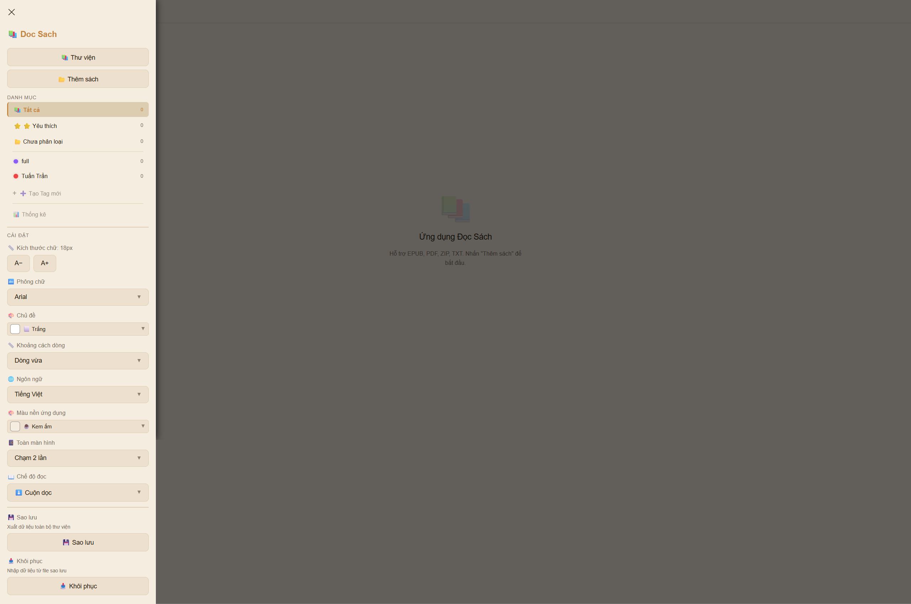
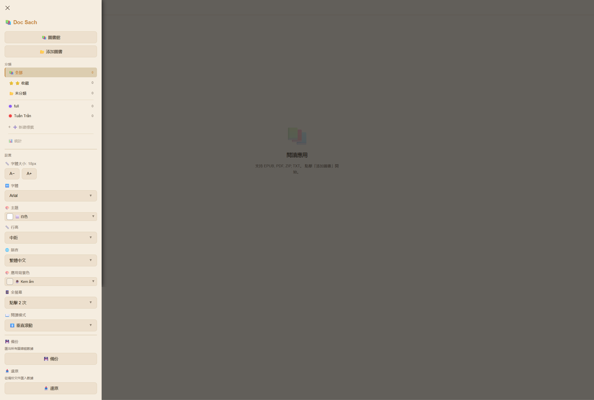

# 📚 Đọc Sách Nè — Doc Sach

<div align="center">

**[🇬🇧 English](#english)** &nbsp;|&nbsp; **[🇻🇳 Tiếng Việt](#vietnamese)** &nbsp;|&nbsp; **[🇨🇳 简体中文](#simplified-chinese)** &nbsp;|&nbsp; **[🇹🇼 繁體中文](#traditional-chinese)**

*A cross-platform offline book reader — Android · Windows · Web (PWA)*

[]()
[]()
[]()
[]()
[]()

### 🌐 Live Demo: [https://duy-readbook.netlify.app](https://duy-readbook.netlify.app)

</div>

## 📸 Preview / Xem Trước

| 📚 Library / Thư Viện | 📖 Reader / Đọc Sách |
|:---:|:---:|
|  |  |

---

<a id="english"></a>
## 🇬🇧 English

### Overview

**Đọc Sách Nè** (Vietnamese for "Read Books Here") is a feature-rich offline book reader supporting **EPUB, PDF, ZIP/CBZ, and TXT** formats. Built as a portfolio project for university application to **Taiwan's Computer Science programs**.

### ✨ Key Features

- 📖 **Multi-format Support** — EPUB, PDF, ZIP/CBZ, TXT with dedicated parsers
- 🌐 **Cross-Platform** — Android (APK), Windows (.exe), Web (PWA)
- 🌍 **4-Language i18n** — Vietnamese, English, Simplified Chinese, Traditional Chinese
- 🎨 **51 App Themes + 8 Reader Themes** — From dark to gradient to light
- 🏷️ **Tag-Based Library** — Categories, search, multi-select management
- 📱 **Rich Reading Experience** — 20+ fonts, vertical scroll, horizontal pagination, pinch-to-zoom
- 💾 **Offline-First** — IndexedDB persistence, PWA with Service Worker cache
- 🔁 **CI/CD** — GitHub Actions auto-builds APK on push

### 🏗️ Architecture

```
src/
├── context/AppContext.jsx      ← React Context (27+ state values)
├── services/
│   ├── parsers.js              ← EPUB/PDF/ZIP/TXT parsers
│   └── covers.js               ← Cover extractors
├── components/BtnDropdown.jsx  ← Reusable UI components
├── App.jsx                     ← Root component + handlers
├── main.jsx                    ← Entry point
├── themes.js                   ← 51 app + 8 reader themes
├── translations.js             ← 4-language i18n
├── db.js                       ← IndexedDB operations
└── __tests__/                  ← Unit tests (Vitest)
```

### 🔄 Data Flow

```
User Action → App.jsx handler → Context state update → Components re-render
                                    ↓
                              db.js → IndexedDB (persist)
                                    ↓
                    Parser → ArrayBuffer → chapters → IndexedDB
```

### 🛠️ Tech Stack

| Technology | Purpose |
|---|---|
| React 19.2 | UI framework |
| Vite 8.0 | Build tool |
| Capacitor 8.3 | Native Android wrapper |
| Electron 42 | Windows desktop app |
| pdfjs-dist 5.7 | PDF rendering |
| JSZip 3.10 | EPUB/ZIP parsing |
| Vitest 4.1 | Unit testing |

### 🚀 Quick Start

```bash
npm install
npm run dev          # Web dev server (http://localhost:5173)
npm run build        # Production build
npm test             # Run 31 tests
npm run electron:dev # Windows desktop dev mode
npm run electron:build # Build Windows .exe
```

### 📦 Distribution

| Platform | Format |
|---|---|
| Android | Signed APK (via Android Studio `Build > Generate Signed APK`) |
| Windows | Portable `.zip` (unzip & run) or `electron-builder --win` |
| Web | PWA deployed on Netlify (installable to desktop) |

### 🔗 Links

- **GitHub**: [DuyTai2003/doc-sach](https://github.com/DuyTai2003/doc-sach)
- **Live Demo**: Deployed on Netlify (PWA)

---

<a id="vietnamese"></a>
## 🇻🇳 Tiếng Việt

### Tổng Quan

**Đọc Sách Nè** là ứng dụng đọc sách ngoại tuyến hỗ trợ **EPUB, PDF, ZIP/CBZ, và TXT**. Được xây dựng làm dự án portfolio để nộp hồ sơ du học ngành **Khoa Học Máy Tính tại Đài Loan**.

### ✨ Tính Năng Nổi Bật

- 📖 **Đa Định Dạng** — EPUB, PDF, ZIP/CBZ, TXT với bộ parser riêng
- 🌐 **Đa Nền Tảng** — Android (APK), Windows (.exe), Web (PWA)
- 🌍 **4 Ngôn Ngữ** — Tiếng Việt, Tiếng Anh, Tiếng Trung Giản Thể, Tiếng Trung Phồn Thể
- 🎨 **51 Chủ Đề App + 8 Chủ Đề Đọc** — Từ tối đến gradient đến sáng
- 🏷️ **Quản Lý Thư Viện Bằng Tag** — Danh mục, tìm kiếm, chọn nhiều
- 📱 **Trải Nghiệm Đọc Phong Phú** — 20+ font, cuộn dọc, lật ngang, pinch-to-zoom
- 💾 **Ưu Tiên Ngoại Tuyến** — IndexedDB lưu trữ, PWA với Service Worker
- 🔁 **CI/CD** — GitHub Actions tự động build APK mỗi lần push

### 🏗️ Kiến Trúc

```
src/
├── context/AppContext.jsx      ← React Context (27+ state)
├── services/
│   ├── parsers.js              ← Parser EPUB/PDF/ZIP/TXT
│   └── covers.js               ← Trích xuất bìa sách
├── components/BtnDropdown.jsx  ← Component UI tái sử dụng
├── App.jsx                     ← Component gốc + handlers
├── themes.js                   ← 51 chủ đề app + 8 chủ đề đọc
├── translations.js             ← i18n 4 ngôn ngữ
├── db.js                       ← Thao tác IndexedDB
└── __tests__/                  ← Unit tests (Vitest)
```

### 🛠️ Công Nghệ Sử Dụng

| Công Nghệ | Mục Đích |
|---|---|
| React 19.2 | Framework UI |
| Vite 8.0 | Công cụ build |
| Capacitor 8.3 | Đóng gói Android native |
| Electron 42 | App desktop Windows |
| pdfjs-dist 5.7 | Render PDF |
| JSZip 3.10 | Parse EPUB/ZIP |
| Vitest 4.1 | Unit testing |

### 🚀 Khởi Động Nhanh

```bash
npm install
npm run dev          # Dev server (http://localhost:5173)
npm run build        # Build production
npm test             # Chạy 31 tests
npm run electron:dev # Chế độ dev desktop Windows
```

### 📦 Phân Phối

| Nền Tảng | Định Dạng |
|---|---|
| Android | APK đã ký |
| Windows | Portable `.zip` (giải nén & chạy) |
| Web | PWA trên Netlify (cài được lên desktop) |

---

<a id="simplified-chinese"></a>
## 🇨🇳 简体中文

### 概述

**Đọc Sách Nè**（越南语"来这里读书"）是一款功能丰富的离线电子书阅读器，支持 **EPUB、PDF、ZIP/CBZ 和 TXT** 格式。本项目作为个人作品集，用于申请**台湾计算机科学专业**。

### ✨ 核心功能

- 📖 **多格式支持** — EPUB、PDF、ZIP/CBZ、TXT，配备专用解析器
- 🌐 **跨平台** — Android (APK)、Windows (.exe)、Web (PWA)
- 🌍 **4语言国际化** — 越南语、英语、简体中文、繁体中文
- 🎨 **51款应用主题 + 8款阅读主题** — 暗色、渐变、亮色
- 🏷️ **标签式书架管理** — 分类、搜索、多选管理
- 📱 **丰富阅读体验** — 20+字体、纵向滚动、横向翻页、双指缩放
- 💾 **离线优先** — IndexedDB 持久化存储，PWA Service Worker 缓存
- 🔁 **CI/CD** — GitHub Actions 自动构建 APK

### 🏗️ 架构

```
src/
├── context/AppContext.jsx      ← React Context (27+ 状态)
├── services/
│   ├── parsers.js              ← EPUB/PDF/ZIP/TXT 解析器
│   └── covers.js               ← 封面提取器
├── components/BtnDropdown.jsx  ← 可复用 UI 组件
├── App.jsx                     ← 根组件 + 事件处理
├── themes.js                   ← 51款应用主题 + 8款阅读主题
├── translations.js             ← 4语言国际化
├── db.js                       ← IndexedDB 操作
└── __tests__/                  ← 单元测试 (Vitest)
```

### 🛠️ 技术栈

| 技术 | 用途 |
|---|---|
| React 19.2 | UI 框架 |
| Vite 8.0 | 构建工具 |
| Capacitor 8.3 | Android 原生封装 |
| Electron 42 | Windows 桌面应用 |
| pdfjs-dist 5.7 | PDF 渲染 |
| JSZip 3.10 | EPUB/ZIP 解析 |
| Vitest 4.1 | 单元测试 |

### 🚀 快速开始

```bash
npm install
npm run dev          # 开发服务器 (http://localhost:5173)
npm run build        # 生产构建
npm test             # 运行31个测试
npm run electron:dev # Windows 桌面开发模式
```

### 📦 分发

| 平台 | 格式 |
|---|---|
| Android | 已签名 APK |
| Windows | 便携版 `.zip`（解压即用） |
| Web | PWA 部署于 Netlify（可安装到桌面） |

---

<a id="traditional-chinese"></a>
## 🇹🇼 繁體中文

### 概述

**Đọc Sách Nè**（越南語「來這裡看書」）是一款功能豐富的離線電子書閱讀器，支援 **EPUB、PDF、ZIP/CBZ 及 TXT** 格式。本專案作為個人作品集，用於申請**台灣資訊工程學系**。

### ✨ 核心功能

- 📖 **多格式支援** — EPUB、PDF、ZIP/CBZ、TXT，具備專用解析器
- 🌐 **跨平台** — Android (APK)、Windows (.exe)、Web (PWA)
- 🌍 **四語國際化** — 越南語、英語、簡體中文、繁體中文
- 🎨 **51款應用主題 + 8款閱讀主題** — 從暗色、漸層到亮色
- 🏷️ **標籤式書櫃管理** — 分類、搜尋、多選管理
- 📱 **豐富閱讀體驗** — 20+字型、縱向捲動、橫向翻頁、雙指縮放
- 💾 **離線優先** — IndexedDB 持久化儲存，PWA Service Worker 快取
- 🔁 **CI/CD** — GitHub Actions 自動建構 APK

### 🏗️ 架構

```
src/
├── context/AppContext.jsx      ← React Context (27+ 狀態)
├── services/
│   ├── parsers.js              ← EPUB/PDF/ZIP/TXT 解析器
│   └── covers.js               ← 封面提取器
├── components/BtnDropdown.jsx  ← 可複用 UI 元件
├── App.jsx                     ← 根元件 + 事件處理
├── themes.js                   ← 51款應用主題 + 8款閱讀主題
├── translations.js             ← 四語國際化
├── db.js                       ← IndexedDB 操作
└── __tests__/                  ← 單元測試 (Vitest)
```

### 🛠️ 技術棧

| 技術 | 用途 |
|---|---|
| React 19.2 | UI 框架 |
| Vite 8.0 | 建構工具 |
| Capacitor 8.3 | Android 原生封裝 |
| Electron 42 | Windows 桌面應用 |
| pdfjs-dist 5.7 | PDF 渲染 |
| JSZip 3.10 | EPUB/ZIP 解析 |
| Vitest 4.1 | 單元測試 |

### 🚀 快速開始

```bash
npm install
npm run dev          # 開發伺服器 (http://localhost:5173)
npm run build        # 生產建構
npm test             # 執行31個測試
npm run electron:dev # Windows 桌面開發模式
```

### 📦 分發

| 平台 | 格式 |
|---|---|
| Android | 已簽署 APK |
| Windows | 可攜版 `.zip`（解壓縮即可執行） |
| Web | PWA 部署於 Netlify（可安裝至桌面） |

---

<div align="center">

### 👨‍💻 About the Author

**Nguyen Duy** — Aspiring Computer Science student applying to Taiwan universities.

[GitHub: DuyTai2003/doc-sach](https://github.com/DuyTai2003/doc-sach)

*Built with ❤️ using React 19, Vite 8, Capacitor 8, Electron 42 — May 2026*

</div>
